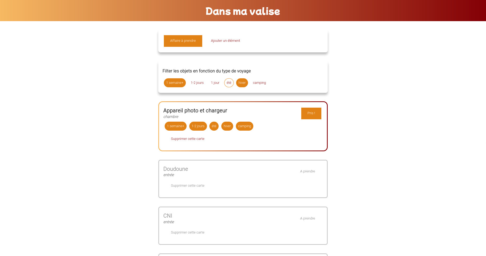
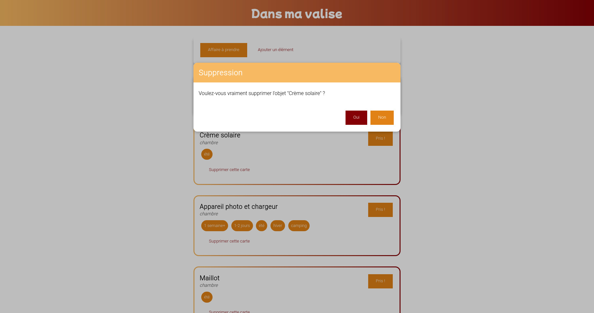
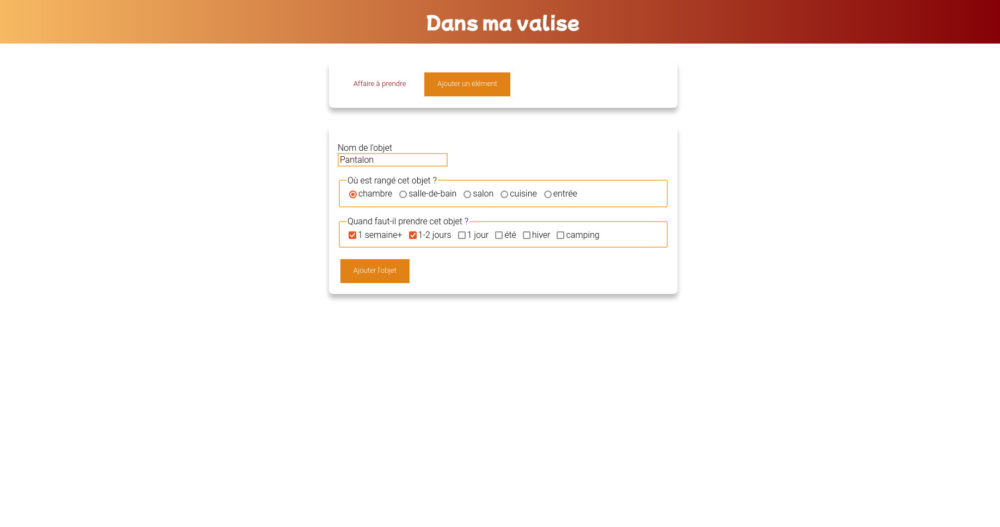

# Dans ma valise v 1.0.0

 

## Contexte du projet

Depuis plusieurs années j'utilise l'application "WeNote" pour gérer une liste d'objets à emporter lors de mes voyages. Cette liste me permet de ne rien oublier. 

Néanmoins cette application ne me permet pas de trier par type de voyage. En effet, la liste m'affiche tout, y compris la doudoune de l'hiver alors que je cherche à faire mon sac pour deux jours de rando en été. 

Aussi (parce que j'adore gagner du temps), je souhaitais pouvoir regrouper mes objets par lieu de rangement pour m'éviter de faire de nombreux aller et retour dans ma maison. 

## Niveau technique

J'ai débuté ce projet lors de mon exploration de VueJs en novembre 2021. Récemmment (janvier 2022) j'ai légèrement améliorer l'application à l'aide des connaissances acquises entre temps. 

Pour l'instant cette application n'est pas couplé avec une API. cette dernière sera développée dans les mois à venir. 

## Concrètement que fait Dans ma valise ? 

Cette application permet d'afficher une liste d'objets à prendre pour ses voyages en précisant le lieu où il est rangé. 

On peut filtrer par type de voyages "2 jours + rando" ou "1 semaine + hiver" etc. Ceci permet de n'afficher que les objets utiles pour ce type de voyage. 

L'utilisateur peut cliquer sur l'objet pour indiquer qu'il est bien dans sa valise. 

L'utilisateur peut rajouter et supprimer des objets. 

## Demo

Vous pouvez tester la démo de cette application à https://dans-ma-valise.alexandrabercoff.com.

## Screenshots du projet







## Stack Technique (prérequis) 

 
 


Vue.js : https://cli.vuejs.org/guide/installation.html

Git : https://git-scm.com/downloads

NodeJS (v12 ou supérieure) : https://nodejs.org/en/download/


## Installer le projet 


1. Télécharger le repo sur votre machine

```bash
git clone <url du repo>
```

2. Installez les dépendances

```bash
cd front-valise
npm install 
```
3. Compilation pour le développement
```
npm run serve
```
4. Compiler et minifier pour la production
```
npm run build
```

